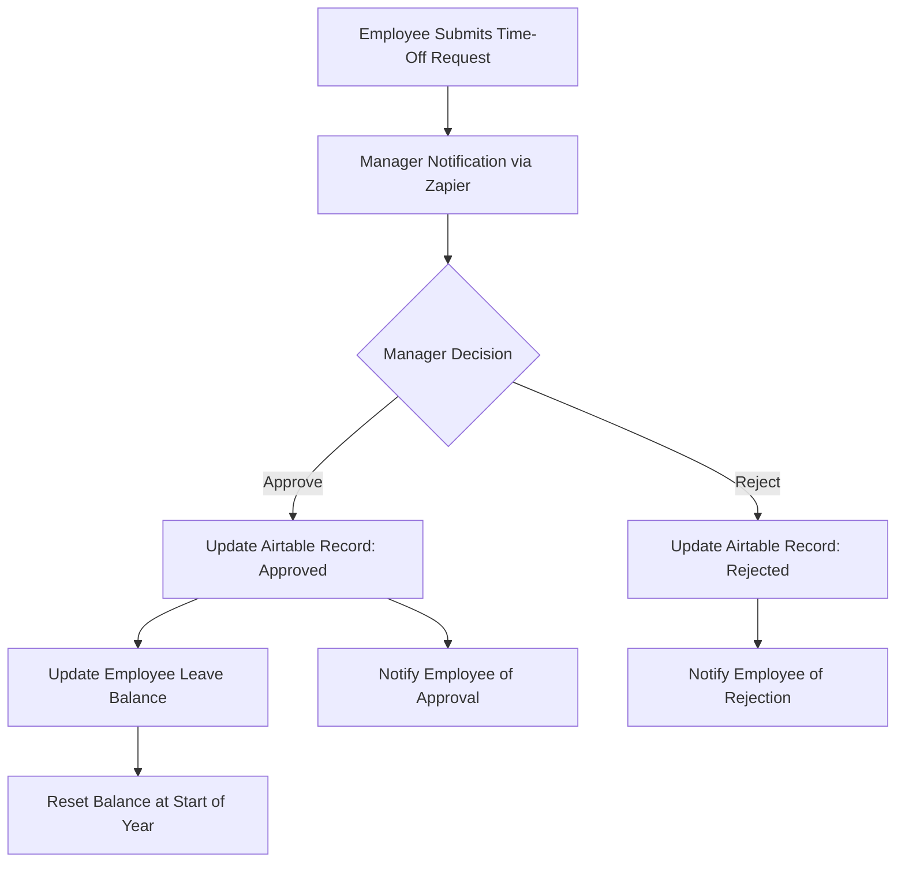

## Automated-Employee-Time-Off-Management-System

**📌 Introduction**

This project focused on building an automated employee time-off management system using Airtable and Zapier. The goal was to streamline the submission, approval, and tracking of Paid Time Off (PTO) requests, while ensuring accurate leave balances and minimising manual administrative work. Each employee is entitled to 22 working days of PTO annually, with balances resetting automatically at the start of the year.

**🎯 Objectives**

The system was designed to:

- Centralise employee, manager, and leave request data.
- Automate notifications and approval workflows.
- Keep employees updated on the status of their requests.
- Manage leave balances automatically.

**⚙️ Features**

1. Time-Off Application: Employees submit leave requests with details (dates, number of days, notes).
2. Manager Notification: Managers receive automated alerts when a request is submitted.
3. Approval Workflow: Managers approve or reject requests with optional comments.
4. Employee Notification: Employees are notified of the decision in real time.
5. Leave Balance Management: Approved requests deduct from balances, which reset to 22 days annually.

**🛠️ Implementation**
- Airtable: Served as the database to store employee, manager, and leave request records.
- Zapier + Airtable Automations: Managed notifications, approvals, and automatic balance updates.

✅ Testing
The system was tested end-to-end to confirm that:
- Requests are captured accurately.
- Notifications are sent at the right stages.
- Approvals and rejections are processed correctly.
- Leave balances update properly.

The image of the form for the employees to log their leave requests is shown below.

- [Employee Submits Time-Off Request]

- [Manager Notification via Zapier]

- {Manager Decision}

-Update Airtable Record

- Update Employee Leave Balance

